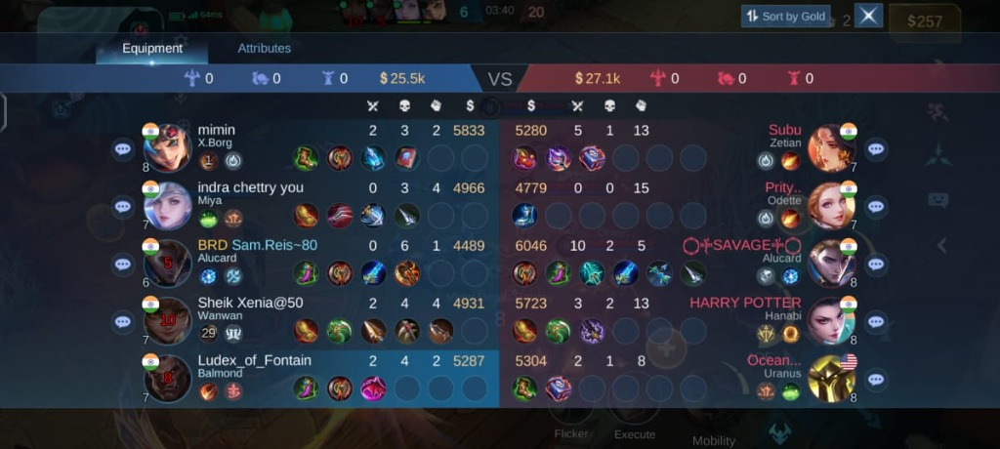

# MLBB Assist - AI Strategy Companion 🤖⚔️

**MLBB Assist** is an intelligent Android overlay application designed for *Mobile Legends: Bang Bang*. It uses Google's Gemini AI to analyze your in-game scoreboard in real-time, providing instant counter-build recommendations, threat analysis, and teamfight strategies without leaving the game.

## 🚀 Key Features
*   **Real-time Analysis**: Analyzes the scoreboard screenshot in seconds.
*   **Counter Builds**: Suggests the best items to counter specific enemy threats.
*   **Threat Detection**: Identifies the most dangerous enemies (fed heroes, high KDA).
*   **Strategic Advice**: Provides tailored teamfight tactics based on your specific match state.
*   **Overlay Interface**: Unobtrusive floating button that expands only when you need it.
*   **Smart Overlay Hiding**: Automatically hides the overlay when analyzing the screen to ensure a clean capture.
*   **Manual Key Selection**: Choose which API key to use or let the app rotate them automatically.

---

## 🛠️ Setup & Configuration

Before using the app, you need to configure a few settings in the main menu.

### 1. Username
Enter your in-game **Username** exactly as it appears in MLBB. This helps the AI identify *which hero is yours* on the scoreboard so it can give you personalized advice.

### 2. API Keys 🔑
This app is powered by the **Google Gemini API**. To use it, you must provide your own API keys.
*   **Why 3 Keys?** The free tier of the Gemini API has rate limits (restrictions on how many requests you can make per minute).
*   **Key Rotation**: The app allows you to enter up to **3 different API Keys**. It automatically rotates through them to prevent you from hitting these limits during intense gaming sessions.

### 🏗️ How to Generate API Keys
1.  Visit **[Google AI Studio](https://aistudio.google.com/app/apikey)** and log in with your Google account.
2.  Click on **"Get API key"**.
3.  Click **"Create API key"** (you can create one in a new project).
4.  Copy the generated key string (starting with `AIza...`).
5.  **Repeat this process** 2 more times (creating new keys/projects) if you want to make full use of the key rotation feature.
6.  Paste these keys into the **Key 1**, **Key 2**, and **Key 3** fields in the app.

---

## 🎮 How to Use

1.  **Open MLBB Assist** and ensure your Username and API Keys are saved.
2.  Tap **"Start Overlay"**. You will see a small floating button appear on your screen.
3.  Launch **Mobile Legends: Bang Bang**.
4.  During a match, whenever you want advice (e.g., while dead or recalling):
    *   Open the **Scoreboard** (tap the top-center score area in-game).
    *   **Tap the Floating Overlay Button**.

    
    *Ensure you are on this screen showing all players and items.*
5.  Wait a few seconds for the AI to analyze the screen.
6.  The overlay will expand to show:
    *   **Top Threats**: Who you need to watch out for.
    *   **Recommended Build**: Items you should buy next.
    *   **Strategy**: How to approach the next fight.

---

## ⚠️ Requirements
*   **Internet Connection**: Required for AI analysis.
*   **Permissions**:
    *   **Display Over Other Apps**: To show the floating button.
    *   **Screen Capture**: To read the scoreboard.

---

*Note: This app is a third-party tool and is not affiliated with Moonton. Use responsibly.*
